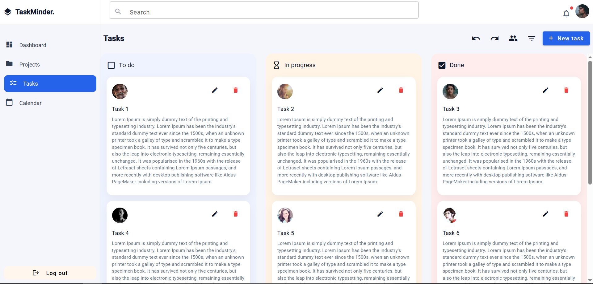
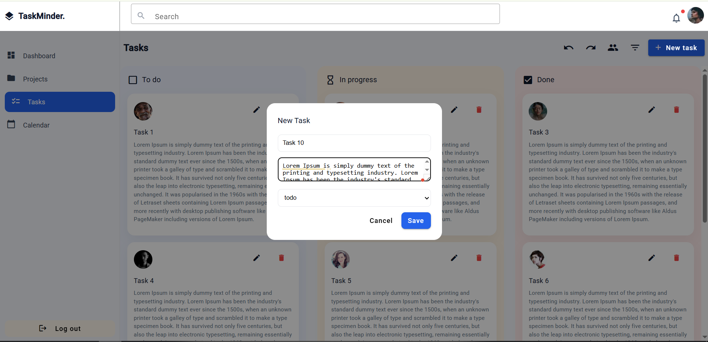
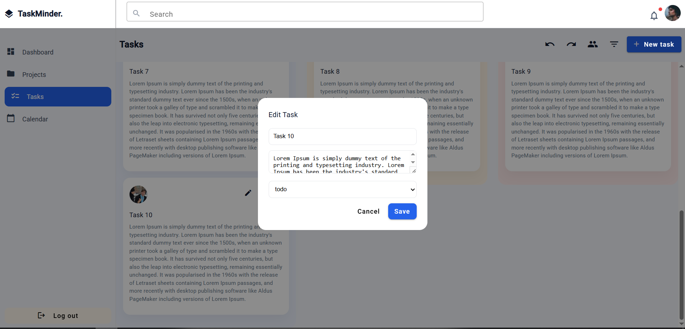
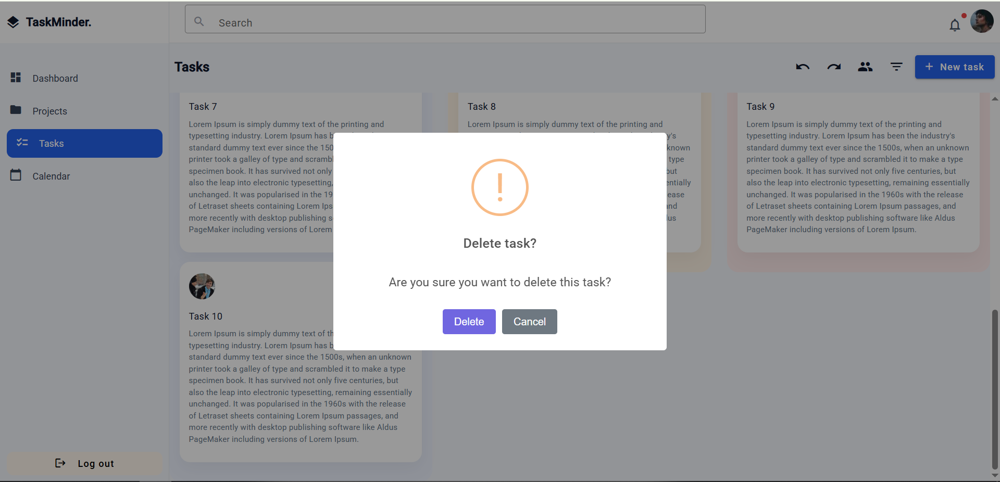
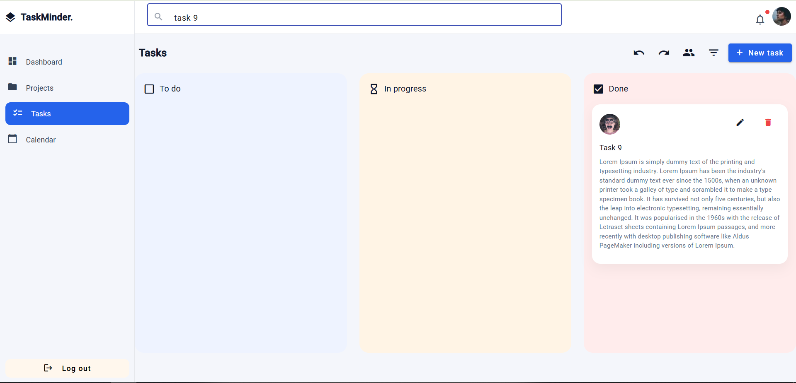

# 🗂 Simple Task Manager

A simple task management dashboard built using **Angular**.  
Users can create, view, edit, delete, and search tasks with a clean UI.

---

## 🚀 Features

- Add new tasks
- Edit existing tasks
- Delete tasks with confirmation
- Task status: **To Do**, **In Progress**, **Done**
- Search tasks by title or description
- SweetAlert confirmation & success popups
- Sticky header and fixed sidebar
- Scrollable task board
- Responsive UI (basic)

---

## 🛠 Tech Stack

- Angular
- TypeScript
- HTML
- SCSS
- Angular Material
- RxJS
- SweetAlert2

---

## 📦 Installation & Run Locally

1. **Clone the repository**

git clone https://github.com/Yogesh-Powar/task-manager

2. Navigate to project directory -
cd task-manager

3. Install dependencies -
npm install

4. Run the application -
ng serve

5. Open browser and visit
http://localhost:4200

## 📸 Screenshots

### Dashboard

### Add New Task

### Edit Task

### Delete Confirmation

### Search Task
